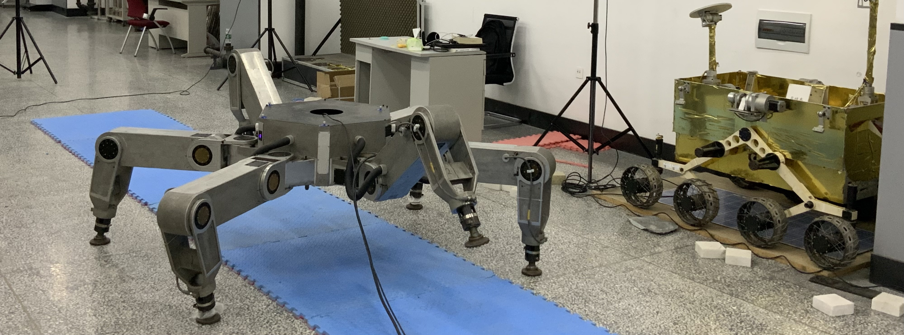

**Legged Robot**, **Motion Planning**, **Environmental Perception** and **Machine learning**.

<!--  -->
<html>

</html>

Education:
======
* Phd. Candidate, Harbin Institute of Technology (HIT), 2020 - Present.
  * Honors: Doctoral National Scholarship
* M.S. Machanical Engineering, Harbin Institute of Technology (HIT), 2018 - 2020
  * Honors: Outstanding Individuals in Innovation and Entrepreneurship, Outstanding Student Leader Models, Excellent Graduation Thesis
* B.S. Automation, Northeastern University (NEU), 2014 - 2018.
  * Scholarship: First-Class Scholarship of Harbin Institute of Technology (Twice).
 

  
Scientific Awards:
======
* **Leaderobot机器人科学引领奖**, 第四届中国机器人行业年会, 2023.
* **Champion**, the 17th China University Robot Competition, 2017.
* **National First Prize**, National college students electronic design competition, 2017.
* **Champion**, the 16th China University Robot Competition, 2016.
* **Runner-up**, The ABU Asia-Pacific Robot Contest, 2016.

<html>
    <table style="width:100%;border:0px;border-spacing:0px;border-collapse:separate;margin-right:auto;margin-left:auto;">
          <tr onmouseout="nightsight_stop()" onmouseover="nightsight_start()">
            <td style="padding:20px;width:50%;vertical-align:middle;border-left-style:none;border-bottom-style:none;border-top-style:none;border-right-style:none">
                <object width="160" height="90" data="https://www.youtube.com/embed/LF42DVWk_dk"></object>
            </td>

            <td style="padding:20px;width:50%;vertical-align:middle;border-left-style:none;border-bottom-style:none;border-top-style:none;border-right-style:none">
                <object width="160" height="90" data="https://www.youtube.com/embed/zoOS4eS_Gyk"></object>
            </td>

          </tr>
    </table>
</html>

<html>
    <table style="width:100%;border:0px;border-spacing:0px;border-collapse:separate;margin-right:auto;margin-left:auto;">
          <tr onmouseout="nightsight_stop()" onmouseover="nightsight_start()">
            <td style="padding:20px;width:50%;vertical-align:middle;border-left-style:none;border-bottom-style:none;border-top-style:none;border-right-style:none">
                <object width="160" height="90" data="https://www.youtube.com/embed/7Y2yZsyo860"></object>
            </td>

            <td style="padding:20px;width:50%;vertical-align:middle;border-left-style:none;border-bottom-style:none;border-top-style:none;border-right-style:none">
                <object width="160" height="90" data="https://www.youtube.com/embed/jYtID53JzXY"></object>
            </td>

          </tr>
    </table>
</html>

<html>
    <table style="width:60%;border:0px;border-spacing:0px;border-collapse:separate;margin-right:auto;margin-left:auto;">
          <tr onmouseout="nightsight_stop()" onmouseover="nightsight_start()">
            <td style="padding:20px;width:100%;vertical-align:middle;border-left-style:none;border-bottom-style:none;border-top-style:none;border-right-style:none">
              <object width="160" height="90" data="https://www.youtube.com/embed/EyN3ycdQZ-8"></object>
            </td>
          </tr>
    </table>
</html>

